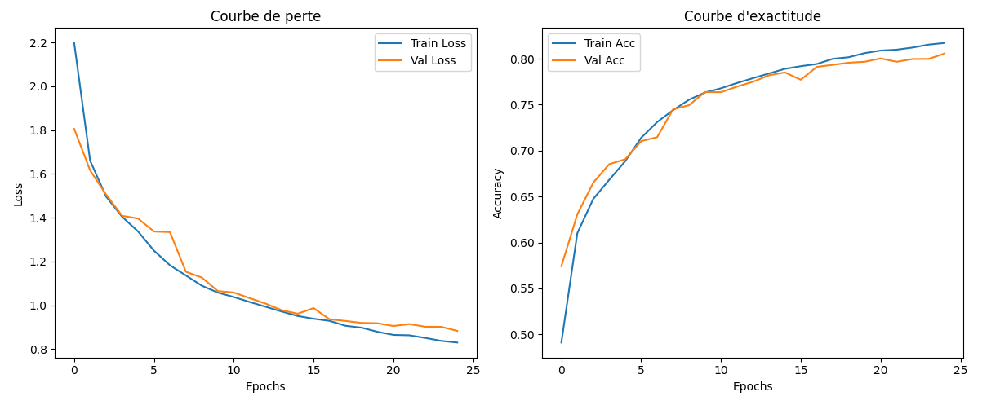
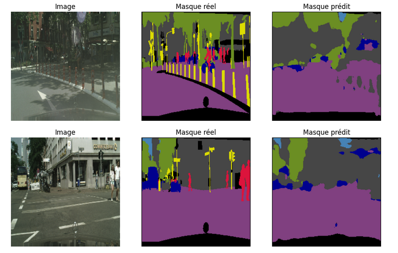
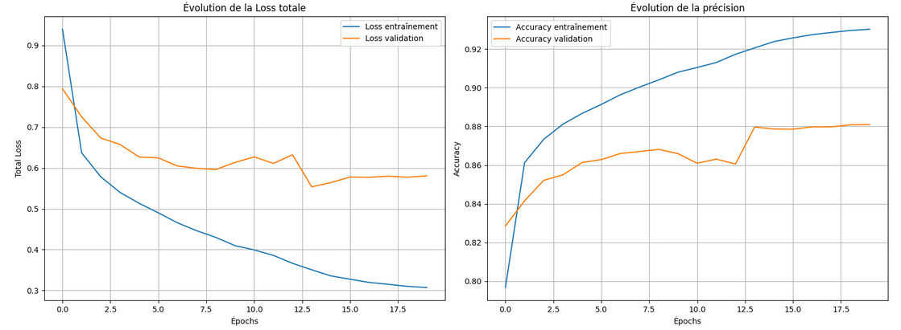
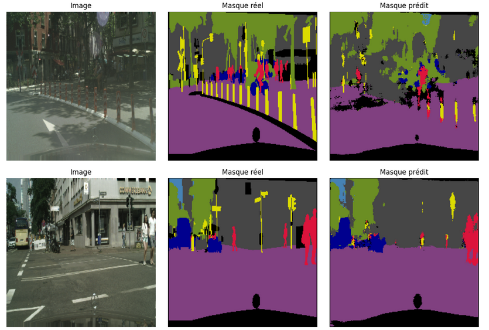
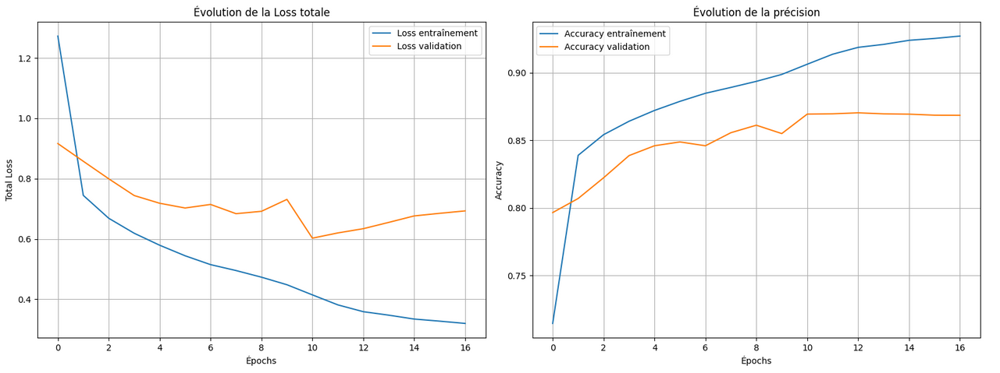

## Rapport technique le 29 juillet 2025

# Segmentation d'Images pour pour le système embarqué d’une voiture autonome

```
Projet réaliser par Djamel Ferguen dans le cadre de la formation AI Engineer d'OpenClassrooms
Projet 8 - Traitez les images pour le système embarqué d'une voiture autonome
```

## Introduction

Dans le cadre de ses travaux sur la **vision embarquée pour véhicules autonomes**, l’entreprise **Future Vision Transport** mène des recherches avancées pour permettre aux voitures de comprendre leur environnement via l’analyse d’images en temps réel.
En tant que membre de l’équipe spécialisée en **intelligence artificielle**, notre responsabilité est de **concevoir et implémenter un module de segmentation sémantique** (composant 3), chargé de traiter les images issues du module de perception (2) avant leur transmission au système de prise de décision (4).

L'objectif est de mettre en place une solution capable de **segmenter avec précision les scènes urbaines** en identifiant **8 grandes catégories d’objets** à partir d’images captées par caméras embarquées.

👉 Cette note décrit le processus de conception, de formation et de déploiement d’un modèle de segmentation optimisé pour l’analyse urbaine.

## Objectifs

- Développer un **modèle de segmentation performant** avec l'architecture Unet
- Implémenter une **API REST** en utilisant FastAPI
- Concevoir une **interface utilisateur de démonstration** en Streamlit
- Faire le **déploiement sur le Cloud** avec l'environnements Azure  
- **documenter** l’ensemble du projet

## Code Source

L'ensemble du projet ( modéle,API,interface,scripts) est disponible sur le dépot GitHub :
● **Projet 8 : link to GitHub**


## Auteur

Ce projet a été développé par **Djamel Ferguen** dans le cadre du parcours AI Engineer d'OpenClassrooms : 
**Projet 8 -
Traitez les images pour le système embarqué d'une voiture autonome**.

## livrables projet

```
● Les scripts développés sur un notebook
● Une FastAPI déployée sur le Cloud Azure
● Une application (Streamlit) de présentation des résultats
● Une note technique de 10 pages
● Un support de présentation pour l'équipe de Laura

```

## 1. Développement du Modèle de Segmentation

```
Le notebook complet de conception du modèle de segmentation d'image est disponible sur Colab.
```
### 1.1 Contexte et Enjeux

La **segmentation sémantique appliquée au domaine automobile** constitue un enjeu technologique majeur.

La segmentation sémantique vise à **attribuer une catégorie précise à chaque pixel**.
Cette fonction est essentielle pour les **véhicules autonomes** : 
il est important de distinguer clairement la route,les véhicules, de détecter les piétons, les objets urbains ou encore la végétation.

On parle ici de **prédiction**, car l’objectif est de produire une image annotée où chaque pixel reflète la nature de l’élément qu’il représente.
Ce niveau de **précision** est indispensable pour une compréhension de **l’environnement routier en conditions réelles**.

### 1.2 Analyse du jeu de données

#### 1.2.1 Le jeu de données Cityscapes

Nous avons choisi le jeu de données Cityscapes, une référence dans le domaine de la segmentation urbaine.
Ce dataset présente plusieurs avantages décisifs pour notre cas d'usage :

- **5 000 images avec annotations fines** réparties en 2 975 images d'entraînement, 500 de validation et
    1 525 de test
- **Diversité géographique** : 50 villes européennes différentes
- **Conditions variées** : Plusieurs saisons, conditions météorologiques bonnes à moyennes
- **Richesse des annotations** : 30 classes détaillées avec des annotations polygonales précises
- **Réalisme** : Images capturées depuis des véhicules en circulation réelle

Le dataset Cityscapes du projet offre de nombreux avantages pour l’entraînement d’un modèle de segmentation :

- **5 000 images annotées avec précision**, réparties en 2 975 pour l'entraînement, 500 pour la validation et 1 525 pour les tests
- **Diversité géographique** : les données proviennent de plusieurs villes européennes
- **Conditions de prise de vue variées** : saisons différentes, météo réaliste
- **Annotations de grande qualité** : 34 classes sémantiques détaillées avec annotations polygonales précises ( JSON)
- **Contexte réel** : les images ont été capturées à bord de véhicules en circulation


Selon la demande de Franck et pour garder une corrélation lors de la prise de décision. On  a utilisé le mapping des catégories suivant en gardant seulement 8 catégories principales : 

class_groups = {
- 'flat': ['road', 'sidewalk', 'parking', 'rail track'],
- 'human': ['person', 'rider'],
- 'vehicle': ['car', 'truck', 'bus', 'motorcycle', 'bicycle', ...],
- 'construction': ['building', 'wall', 'fence', 'bridge', ...],
- 'object': ['pole', 'traffic sign', 'traffic light', ...],
- 'nature': ['vegetation', 'terrain'],
- 'sky': ['sky'],
- 'void': ['unlabeled', 'out of roi', ...]
}

#### 1.2.3 Préparation des Données

Les données dans notre projet intégrent plusieurs étapes :

**Redimensionnement intelligent** : Les images Cityscapes originales (2048×1024) sont redimensionnées à
224×224. Cette taille est optimale pour l'utilisation de VGG16 pré-entraîné.

**Train/Validation** : Pour éviter le "data leakage = surapprentissage", nous avons adopté l'approche suivante :

- **dataset 'train'** 
- **dataset 'val'** Pour garantir que notre modéle est réalisés sur de nouvelles données 
- **Augmentation de données** : Nous avons implémenté des techniques d'augmentation adaptées à la segmentation tels que :

  - Flip horizontal
  - Contraste & luminosité
  - Saturation
  - Rotation aléatoire (0, 90, 180, 270°)
  - Zoom (recadrage aléatoire)
  - Bruit gaussien
  
### 1.3 Architecture du Modèle : UNet-mini
L’architecture **U-Net Mini** est une version simplifiée du modèle U-Net conçu pour la **segmentation sémantique d’images**. Elle suit une structure en **encodeur-décodeur symétrique** avec des **connexions par saut** (skip connections) entre les couches de même niveau. L’encodeur extrait les **caractéristiques spatiales** via des blocs de convolution suivis de **max pooling**, tandis que le décodeur reconstruit la carte de segmentation avec des **upsampling** (ou transposed convolutions). Moins profonde que l’U-Net original, elle est plus légère et adaptée aux contextes à **faibles ressources** ou temps réel. Malgré sa simplicité, elle reste efficace pour les tâches de segmentation basiques.

- **Objectif** : Attribuer une classe à chaque pixel de l'image (segmentation).


#### Architecture U-Net Partie encodeur (descendante)

L’encodeur extrait les **caractéristiques importantes** de l’image. Il est composé de **blocs de convolution + ReLU**, suivis de **MaxPooling** pour réduire progressivement la taille de l’image tout en capturant des **informations de plus haut niveau**. Chaque couche descendante réduit la résolution mais augmente la profondeur des canaux.


#### Partie décodeur (ascendante)

Le décodeur reconstruit la **carte de segmentation** à partir des caractéristiques extraites. Il utilise des **upsampling** (ou Conv2DTranspose)pour augmenter la résolution. À chaque étape, il concatène les **caractéristiques correspondantes de l’encodeur** via des **skip connections**, permettant une reconstruction plus précise.

Ensemble, ces deux parties permettent de combiner **contexte global** et les **détails fins**.


#### Paramètres

- Nombre total de paramètres : environ 850 000
- Le nombre de filtres double à chaque niveau de profondeur dans l’encodeur : 32 → 64 → 128
- Le décodeur réutilise les features de l’encodeur via des connexions de skip, et reconstruit l’image
- Tous les paramètres sont entraînables, car il n’y a pas de backbone pré-entraîné (tout est appris from scratch)
	

### 1.4 Architecture du Modèle : VGG16 + UNet-mini

Ce modèle combine **VGG16** comme encodeur et une structure **U-Net** pour le décodeur.
VGG16, pré-entraîné sur ImageNet, fournit des **caractéristiques visuelles riches**.
Les **couches profondes de VGG16 sont gelées**, évitant un sur-apprentissage initial.
Les **skip connections** permettent de réinjecter les détails spatiaux à chaque niveau de décompression.
Le **bottleneck** (block5) représente l’information compressée et abstraite de l’image.
Le décodeur reconstruit progressivement la **segmentation pixel par pixel** via des **Conv2DTranspose**.
Une **couche finale softmax** prédit la probabilité de chaque classe pour chaque pixel.


#### Architecture U-Net + VGG16 Partie encodeur (descendante)

L’encodeur est constitué des **5 blocs convolutionnels de VGG16** sans la partie classification.
Chaque bloc contient **2 ou 3 convolutions + une max pooling**, réduisant progressivement la taille de l’image.
On extrait les **sorties intermédiaires** après chaque bloc **(block1_conv2, ..., block4_conv3)** pour les **skip connections**.
Ces couches retiennent les **détails spatiaux essentiels** pour une bonne segmentation.
Le **block5_conv3** agit comme un **bottleneck**, compressant l’information en vecteurs plus abstraits.
Grâce à l’apprentissage sur ImageNet, VGG16 encode efficacement les **textures, bords, formes**.
Toutes les couches du backbone sont **gelées** (trainable=False) par défaut pour accélérer l’entraînement.

#### Partie décodeur (ascendante)

Le décodeur reconstruit la carte de segmentation à partir du bottleneck **(block5_conv3)**.
Il utilise une série de **Conv2DTranspose** pour **augmenter progressivement la résolution spatiale**.
À chaque étape, les **features sont concaténées** avec les couches correspondantes de l’encodeur (skip connections).
Cette concaténation préserve les **informations de localisation** perdues pendant l'encodage.
Chaque étape de décompression est suivie d'une ou deux **couches convolutionnelles (ReLU)** pour affiner les détails.
La **dernière couche** applique un **Conv2D** avec **softmax** pour générer une **probabilité par classe** par pixel.
Le résultat final est une **masque segmenté 224x224x8**, avec une classe prédite pour chaque pixel.

##### Construction, Entraînement du Modèle et Optimisation

#### Paramètres

L'architecture comporte **environ 14,7 millions de paramètres**, dont **environ 2 millions sont entraînables** (le décodeur uniquement).
Les couches du **backbone (VGG16)** sont gelées, ce qui accélère l’apprentissage.
Le décodeur est composé de **4 niveaux de transposition + convolutions**, avec **skip connections** vers les couches correspondantes de VGG16.
Une couche finale **Conv2D(8, 1, softmax)** prédit **8 classes** de segmentation pour chaque pixel.
	

#### Analyse de l'entraînement du modèle

### 1.5 Évaluation et Métriques

#### 1.5.1 Métriques de Performance

L'évaluation de modèles de segmentation nécessite des métriques spécialisées. Nous utilisons
principalement :

#### Accuracy : 
Mesure le pourcentage de pixels correctement classés. Peu fiable en cas de classes déséquilibrées.

#### Dice :
Mesure le chevauchement entre les masques prédits et réels. Très adaptée pour évaluer la **qualité de la segmentation**.

#### Total_loss ( Dice_loss + Crossentropy) :
Combine la **Dice loss** (sensibilité au chevauchement) et la **Cross Entropy** (erreurs de classification). Permet un **équilibre entre précision locale et globale**.

#### IoU (Intersection over Union) :
Évalue la qualité de la prédiction par classe (intersection / union). C’est une métrique **standard et recommandée pour la segmentation**.

#### 1.5.2 Résultats   

#### Graphiques et exemples de visualisations  
##### Unet-mini




##### VGG16+Unet




##### VGG16+Unet sans data augmentation




#### X.X.X Analyse des Performances 


- **Le modèle Unet‑mini** est ultra‑léger et rapide (~1 h 30) mais plafonne à 80 % d’accuracy, avec un loss de 0.88

- **U‑Net + VGG16** (1 h 45) atteint près de 88 % d’accuracy et 0.85 de Dice, doublant la performance du Unet‑mini.
- **L’augmentation des données** stabilise et renforce légèrement la généralisation, sans sur‑apprentissage notable.

- **Le backbone VGG16 pré‑entraîné** donne une robustesse et limite le besoin en réglages

- la version **U‑Net + VGG16** avec data augmentation est choisi pour le **déploiement sur le cloud**, afin de garder une sécurité en ce qui concerne la  variabilité du terrain


Intersection over Union (IoU) par classe pour le modéle retenue :

- Classe 0 (Flat): IoU = 91.06%
- Classe 1 (Human): IoU = 39.92%
- Classe 2 (Vehicle): IoU = 74.58%
- Classe 3 (Construction): IoU = 74.10%
- Classe 4 (Object): IoU = 19.11%
- Classe 5 (Nature): IoU = 78.67%
- Classe 6 (Sky): IoU = 86.69%
- Classe 7 (Void): IoU = 64.90
- IoU Moyenne (mIoU): 66.13%

#### Points Forts :

- **Excellente détection des surfaces planes** (Flat, Sky)
- **Bonne segmentation des grandes structures** (Construction, Nature)

#### Points d'Amélioration :

- **Détection des objets fins** (Object)
- **Segmentation des humains** (Human)
- **Besoin d'optimisation pour les petits objets,confusion avec les personnes**


#### 1.5.4 Impact de l'augmentation des données

- L'impact de la data augmentation n'offre pas une meilleure performance donc il n'apporte pas de valeurs ajoutée
- Pas de sur-apprentissage, l'Accuracy reste stable avec et sans augmentation de données

## 2. Développement et déploiement de l'application

Le workflow de déploiement est réalisé en 3 phases voir photo ci-dessous :


### 2.1. Développement de l'application-web

### 2.1.1 Backend (FastAPI) 

L'interface communique avec l' **API FastAPI** de ségmentation sémantique d'images via des **requêtes HTTP** :

- **Endpoint** : POST /predict pour l'analyse d'images
- **Format** : Multipart/form-data pour l'upload de fichiers
- **Réponse** : JSON contenant les images encodées


### 2.1.2 frontend (Streamlit) 

Pour valider les performances de notre modèle en conditions réelles, nous avont utiliser l'interface frontend pour réaliser une prédiction 
L'application Streamlit sert d’interface visuelle avec le modèle de segmentation, on a :

- **Chargement** d’image via une interface simple (format JPG/PNG)
- **Envoi** de l’image à l’API FastAPI via une requête POST /predict
- **Affichage** du masque de segmentation colorisé et superposé à l’image d’origine
- **Téléchargement** possible du masque et de l’image annotée
- **Légende** affichant la signification de chaque classe prédite 
 Cette interface favorise la validation utilisateur et peut être déployée sur le cloud ou localement.
 
 
 
	
### 2.2. Déploiement de l'application-web
 
Pour automatiser le déploiement de notre modèle, nous avons mis en place un **pipeline CI/CD (Intégration Continue / Déploiement Continu)** avec les composants suivants :

1. **Versionnement du code** : utilisation de Git pour le contrôle de version
2. **GitHub Actions** : automatisation des tests et du déploiement à chaque push sur la branche (analyse_sentiments)
3. **Déploiement sur Azure** : plateforme Cloud pour héberger notre API de segmentation urbaine

### GitHub Actions 

Le déploiement est entièrement automatisé grâce à **GitHub Actions** :

1. **Déclenchement** : À chaque commit/push sur la branche(segmentation), GitHub Actions lance le workflow.
2. **Tests automatisés** : Le workflow exécute tous les tests unitaires.
3. **Déploiement conditionnel** : Uniquement si les tests réussissent, l'application est déployée automatiquement sur Azure .[Test API ](https://segmentation-urbaine.azurewebsites.net/)


#### Création du workflow GitHub Actions


Pour le réaliser, nous créons un fichier `.github/workflows/voiture-autonome_segmentation-urbaine.yml`

#### Configuration des secrets GitHub

Le workflow **GitHub Actions** a besoin d'accéder aux **variables d'environnement**. Nous avons donc renseigner les "secrets" nécessaires. Dans notre dépôt GitHub, nous allons dans "Settings" > "Secrets and variables" > "Actions", puis nous cliquons sur "New repository secret". Nous ajoutons les secrets suivants:


### Déploiement sur Azure

Pour le déploiement de notre solution, nous avons choisi [Azure](https://azure.microsoft.com/) pour plusieurs raisons :

1. **Plan B1** : Plan de service de base 
2. **Intégration avec GitHub** : facilite le déploiement continu avec GitHub Actions
3. **Scalabilité** : possibilité d'évoluer si le projet est approuvé pour la production


#### Configuration Azure

Notre application utilise les fichiers de configuration suivants pour Azure :

- **Dockerfile**
- **start.sh**
- **requirements.txt** : Liste de toutes les dépendances nécessaires

#### Docker **Il faut parler 

Le Dockerfile construit une image contenant FastAPI, Streamlit et les dépendances nécessaires. Au démarrage, le script start.sh télécharge le modèle unet_vgg16_best.h5 depuis Azure Blob Storage.


- **Isolation & portabilité** : un conteneur regroupe toute l'application (FastAPI + Streamlit + dépendances) dans un environnement cohérent et réutilisable.

- **Déploiement** : ACR permet de stocker et gérer les images Docker, prêtes à être déployées sur Azure App Service.

- **Compatibilité Cloud** : Azure App Service peut exécuter directement une image Docker depuis ACR, sans se soucier des dépendances.

- **Déploiement automatisé** : GitHub Actions peut builder, pousser l’image sur ACR et la déployer automatiquement.

- **Multi-services unifiés** : Streamlit (UI) et FastAPI (backend) peuvent tourner ensemble dans un même conteneur, sur un seul port exposé.

- **Scalabilité & maintenance** : plus simple de mettre à jour ou répliquer l’application avec une nouvelle version du conteneur.

### Exemple d'exécution et déploiement réussis


La vidéo de démonstartion suivante indique que le déploiement est réussi sur **Azure**.

[🎬 Voir la vidéo de démonstration](https://drive.google.com/file/d/1emriX90TvYEk3OCLZuOroHglAPwQ9T7S/view?usp=drive_link)


## Pistes d'Amélioration 
 **Modélisation** : 
**Modélisation** : 
Augmenter le volume de données ( météo, saisons et éclairage jour/nuit) ou bien utiliser d’autres base de données comme ( Mapillary Vistas , BDD100K,..)
Remplacer VGG16 par des architectures plus modernes tel que Resnet50

Utilisation du module **CBAM** (Convolutional Block Attention Module) pour mettre en évidence les informations importantes dans les images et améliorer la détection des petits objets :
 Le Channel Attention sélectionne les canaux les plus utiles via pooling et MLP, apprenant ainsi quoi   regarder(ex.routes,piétons).
 Le Spatial Attention applique une carte de focus par convolution pour mettre en avant les zones clés de l’image, décidant où regarder.

**Déploiement** :
Pour les modèles d’entrainement lourd. Une optimisation de l’image Docker (dépendances) réduirait la taille et facilite le choix d’abonnement Cloud plus économique

 
## Conclusion Générle 

Ce projet a pour objectif en tant qu’ ingenieur data science de développer un module de segmentation d’images pour identifier le 8 classes demandés ( voiture, humains,végétation,…)  et l’intégrer dans la chaine de production

Une phase initiale de prétraitement des données pour entrainer les architectures de type U-net a permis de sélectionné le meilleur model (Unet+VGG16) avec des métriques acceptables ( total_loss=0.55 ; Dice=0.85 ; Acccuracy =0.87)

Une fois le modèle validé, il a été implanter dans une API, déployer dans le cloud avec le pipeline CI/CD de GitHub Actions et documenter dans une note technique pour destinée a l’équipe projet    

Pour les perspectives, plusieurs optimisations sont possibles : enrichir le dataset avec des conditions variées, adopter des architectures plus modernes comme ResNet50, ou encore intégrer des modules d’attention comme CBAM pour améliorer la détection des petits objets.

Cette solution illustre le potentiel de l’IA dans les systèmes embarques des voitures autonomes de la modélisation (prédictions) jusqu’au déploiement 
